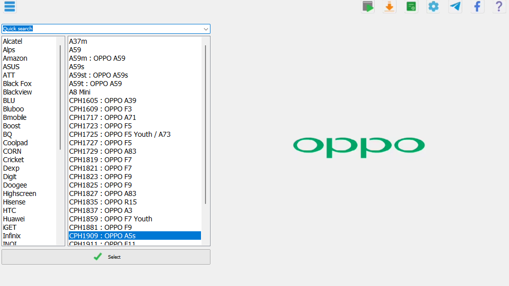
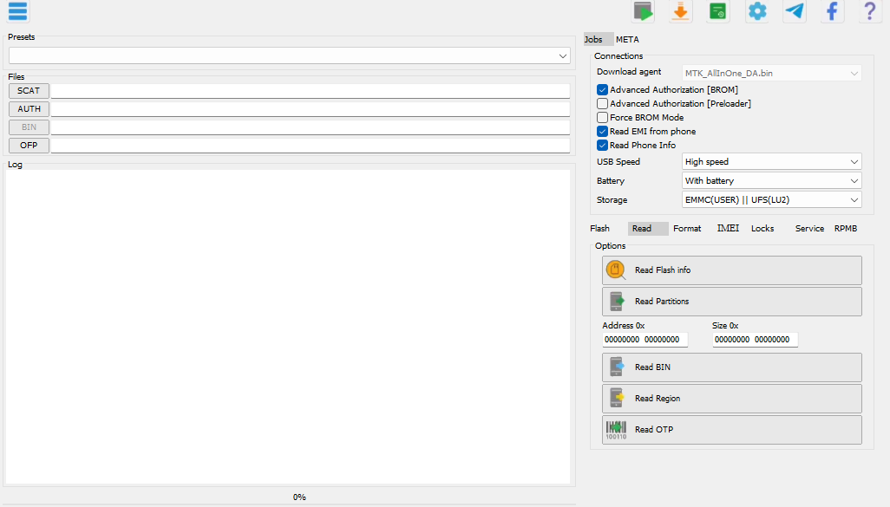

# Reference UI implementation and verification

## Verified Windows previews

These are real Win64 client captures from the completed UI, not mockups. They remain the layout/artwork references; after the support-data integration, the disabled Download agent field shows the resolved bundled filename and size instead of the earlier generic label.

### MAIN 1



### MAIN 2



## Verification results

- Win32 and Win64 builds and `--selftest`: **passed**.
- 13 platform-independent UI/resource contracts: **passed**.
- Actual 96-, 144- and 192-DPI control/tab bounds: **passed**.
- Enter/Space activation, disabled buttons and Tab navigation: **passed**.
- Complete visible 14-digit IMEI, independent Format radio groups, CSV
  round-trip, platform profiles and existing input validation: **passed**.
- Pixel comparison of the Win64 MAIN 1 capture against S1: all **eight
  toolbar cards and the OPPO logo are pixel-identical** (zero channel error).
- All reference operation states, the Flash dropdown and the separate
  log/progress/profile views were captured and visually reviewed.

Validation build: [Windows CI run 37610161230](https://github.com/rehmaahmed11/MOBILE-SERVICING-TOOLS/actions/runs/37610161230)
(source commit `05936fe`; these previews do not alter application code).

## Reference states

The supplied images are the source of truth for client layout and artwork:

| Reference | UI state | CI screenshot |
| --- | --- | --- |
| S1 | OPPO brand/model selector, CPH1909 selected | `main1.png` |
| S2, S7 | Jobs → IMEI | `main2-imei.png` |
| S3 | Jobs → Flash, normal write | `main2-flash.png` |
| S4 | Flash mode dropdown open | `main2-flash-modes.png` |
| S5 | Jobs → Read | `main2-read.png` |
| S6 | Jobs → Format | `main2-format.png` |
| S8 | Jobs → Locks | `main2-locks.png` |
| S9 | Jobs → Service | `main2-service.png` |
| S10 | Jobs → RPMB | `main2-rpmb.png` |

MAIN 1 uses a **1023 × 575** client at 96 DPI. MAIN 2 uses **1026 × 585**,
matching S2. The other supplied MAIN 2 images have slightly different crop
sizes (1026–1030 pixels wide, 583–591 tall); those do not define different
window sizes. Native title bars/window shadows are intentionally excluded
from review captures, as they are from the supplied references. The actual
app retains normal Windows window controls.

## Completed visual details

- Actual sample toolbar cards, not approximate vector icons; toolbar order,
  positions, colours, shadows and spacing are shared between both forms.
- Actual lowercase OPPO logo; S1's list bounds, 17-pixel row pitch, larger
  list font, Quick search position and centred tick/Select button.
- The visible S1 OPPO entries and brand headings; empty headings are
  explicit categories and survive CSV export/import without invented models.
- Fixed-width right column, the two-column download-agent row, 16-pixel
  connection checkbox pitch and the reference selected connection defaults.
- Four compact file rows for MediaTek; Samsung's extra rows still work and
  move/reduce the log area without overlapping it.
- Theme-independent frames and button faces, framed Options panels, real
  compact tabs with no overflowing RPMB tab/native scroll arrows.
- 10-pixel Tahoma labels/tabs and 9-pixel action captions, serif IMEI values, pale check-digit fields,
  the bold blue Advanced settings link and compact hex address fields.
- Independent Format mode/range radio groups; the last Format action is
  fully visible at the minimum window size.
- Blank idle log and clean progress redraw. Model/profile context is logged
  when running jobs; USB addition/removal events are still recorded.

The forms are not screenshots painted over dummy hit targets. All lists,
inputs, dropdowns, checks and radios are editable native widgets; each
painted action button has its original handler and supports mouse, Tab,
Space and Enter. Compact tab strips support mouse and arrow/Home/End keys.
The standard native widget/font rasterization and title bar can still vary
with Windows version, theme and display DPI; the reference artwork and
96-DPI layout geometry do not rely on those theme-dependent metrics.

## Reproducible artwork

`Delphi/DeviceSetup/assets/sample-ui/manifest.json` records each asset's
source image and crop rectangle. Only small icons (28 × 28) and the OPPO
wordmark (270 × 48) are embedded; there are no full-screen bitmap controls.
All artwork is linked into the portable EXE by `SampleAssets.res`.

Normal builds require no Pillow or separate image files. To check resources:

```sh
python Delphi/DeviceSetup/tools/make_ui_resources.py --check
python Delphi/DeviceSetup/tools/test_ui_contract.py
```

To repeat the original crops after deliberately changing the references:

```sh
python -m pip install Pillow
python Delphi/DeviceSetup/tools/extract_sample_assets.py
python Delphi/DeviceSetup/tools/make_ui_resources.py
```

The small resource is committed intentionally so building in RAD Studio
needs no external resource compiler or Python pre-build step.

## Windows validation

`DeviceSetup.exe --selftest` verifies actual window/client sizes and control
bounds, not merely compiler success. It captures the clean reference states
**before** file/IMEI validation tests or demo log output, and additionally
checks the 144/192-DPI layouts for clipped tabs and buttons. A separate
`main2-log.png` demonstrates the coloured log without contaminating the
sample comparisons. The open Flash dropdown is a screen capture, because
native popups are separate windows; other images use client-only PrintWindow.

Win32 and Win64 CI upload the EXEs, self-test log and lossless PNGs. Win64
also publishes those PNG bytes in numbered `ci-shot` check runs for review
through the GitHub API. To reconstruct them without downloading artifacts:

```sh
python Delphi/DeviceSetup/tools/read_ci_screenshots.py --sha <commit> --output <review-directory>
```

Unlike the old GIF transport, this does not introduce
256-colour dithering or alter the appearance of fonts and backgrounds.

**Scope:** the reference interface catalogs the real supplied DA/FDL payloads
and the portable package preserves the complete support tree. That only proves
file presence and integrity against the checked-in hash inventory; it does not
prove vendor authenticity or exact device compatibility.

Job buttons are wired to the job engine: each one opens the capture window,
waits for the phone, takes its COM port with an exclusive handle, runs the
operation and then releases the port (see the *Device jobs* section of the
README for what is implemented per platform). The **screens and their geometry
are unchanged by that work** — the capture window is a separate dialog built in
code, and nothing in `Main2Form.dfm` moved, so every screenshot contract here
still holds byte-for-byte. Operations whose vendor protocol is not public fail
with an explicit reason instead of reporting success.
